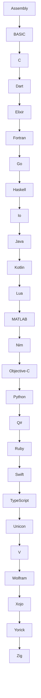

<h1 align="center">🚀 A–Z List of Programming Languages</h1>

  
  
  

  

---

## 📖 Description  

This repository contains an **A–Z list of programming languages**, ranging from classic low-level languages like **Assembly** and **C**, to modern ones such as **Kotlin**, **TypeScript**, and **Zig**.  

The goal of this project is to provide:  
- ✅ A quick reference for students, developers, and tech enthusiasts.  
- ✅ A fun way to explore different programming languages from **A to Z**.  
- ✅ Multiple formats:  
  - 📜 Detailed list with emojis.  
  - 📊 Compact table for easy reading.  
  - 🔗 Mermaid diagram for visual learners.  

Perfect for learning, inspiration, or just geeking out about programming languages! 🚀  

---

---

## 1️⃣ Versi Daftar (List dengan Emoji)

### 🅰️ Assembly  
Low-level language used to communicate directly with hardware.  

### 🅱️ BASIC  
Beginner’s All-purpose Symbolic Instruction Code – great for early learning.  

### 🌐 C  
Powerful systems programming language used in OS, embedded systems.  

### 🎯 Dart  
Used primarily for Flutter to build cross-platform mobile apps.  

### ⚡ Elixir  
Functional language for scalable, maintainable applications.  

### 🧮 Fortran  
One of the oldest languages, still used in scientific computing.  

### 🐹 Go (Golang)  
Developed by Google, known for its simplicity and performance.  

### λ Haskell  
Purely functional language used in academia and finance.  

### 🔹 Io  
Minimalist prototype-based language with a small syntax.  

### ☕ Java  
Versatile, object-oriented, used in enterprise, Android, and web apps.  

### 📱 Kotlin  
Modern JVM language, official for Android development.  

### 🎮 Lua  
Lightweight scripting language often used in game development.  

### 📊 MATLAB  
Designed for numerical computing and simulations.  

### ⚙️ Nim  
Statically typed compiled language that is fast and expressive.  

### 🍏 Objective-C  
Used mainly for macOS and iOS development (pre-Swift era).  

### 🐍 Python  
Beginner-friendly, widely used in data science, web, AI, automation.  

### 🧑‍🔬 Q#  
Quantum programming language developed by Microsoft.  

### 💎 Ruby  
Elegant syntax, used in web development (especially Rails framework).  

### 🍎 Swift  
Apple’s modern language for iOS, macOS development.  

### 📘 TypeScript  
Superset of JavaScript adding static types, improving large-scale JS apps.  

### 🔗 Unicon  
Language combining goal-directed evaluation with object-oriented features.  

### ✅ V  
Simple, fast language designed for safety and readability.  

### 📐 Wolfram Language  
Used in Mathematica, powerful for symbolic computation and math.  

### ❎ Xojo  
Cross-platform app development language with a VB-like syntax.  

### 🔬 Yorick  
Used in scientific simulations and numerical computation.  

### 🧩 Zig  
Low-level, safe language for systems programming, alternative to C.  

---

## 2️⃣ Versi Tabel (Compact)

| Letter | Language       | Description |
|--------|----------------|-------------|
| A      | Assembly       | Low-level language used to communicate directly with hardware. |
| B      | BASIC          | Beginner’s All-purpose Symbolic Instruction Code – great for early learning. |
| C      | C              | Powerful systems programming language used in OS, embedded systems. |
| D      | Dart           | Used primarily for Flutter to build cross-platform mobile apps. |
| E      | Elixir         | Functional language for scalable, maintainable applications. |
| F      | Fortran        | One of the oldest languages, still used in scientific computing. |
| G      | Go (Golang)    | Developed by Google, known for its simplicity and performance. |
| H      | Haskell        | Purely functional language used in academia and finance. |
| I      | Io             | Minimalist prototype-based language with a small syntax. |
| J      | Java           | Versatile, object-oriented, used in enterprise, Android, and web apps. |
| K      | Kotlin         | Modern JVM language, official for Android development. |
| L      | Lua            | Lightweight scripting language often used in game development. |
| M      | MATLAB         | Designed for numerical computing and simulations. |
| N      | Nim            | Statically typed compiled language that is fast and expressive. |
| O      | Objective-C    | Used mainly for macOS and iOS development (pre-Swift era). |
| P      | Python         | Beginner-friendly, widely used in data science, web, AI, automation. |
| Q      | Q#             | Quantum programming language developed by Microsoft. |
| R      | Ruby           | Elegant syntax, used in web development (especially Rails framework). |
| S      | Swift          | Apple’s modern language for iOS, macOS development. |
| T      | TypeScript     | Superset of JavaScript adding static types, improving large-scale JS apps. |
| U      | Unicon         | Language combining goal-directed evaluation with object-oriented features. |
| V      | V              | Simple, fast language designed for safety and readability. |
| W      | Wolfram        | Used in Mathematica, powerful for symbolic computation and math. |
| X      | Xojo           | Cross-platform app development language with a VB-like syntax. |
| Y      | Yorick         | Used in scientific simulations and numerical computation. |
| Z      | Zig            | Low-level, safe language for systems programming, alternative to C. |

---

## 3️⃣ Versi Mermaid (Diagram)

<h3 align="center" style="color:#39ff14; font-size:1.5rem;">
💡 ☕ Traktir Kopi & Nasi Padang / Nasi Gorengnya ya cuy! 😄
</h3>

Dukung terus biar semangat bikin karya edukatif lainnya...  
Keep supporting so I stay motivated to create more educational works!

Support with ☕ so I can buy 🍜 and keep being 🧠!

---

<h2 align="center" style="color:#39ff14;">📫 Let’s Connect together</h2>

  
  
  
  

  
  
  
  

---

<h3 align="center" style="color:#ff69b4;">❤️ 💻 INITIATING HUMANITY MODE... for Down Syndrome ❤️</h3>

<table style="margin: 0 auto; border-collapse: collapse; box-shadow: 0 4px 10px rgba(0,0,0,0.2); border-radius: 8px; overflow: hidden;">
  <thead style="background-color:#ff69b4; color:white;">
    <tr>
      <th style="padding: 12px 25px; font-size: 18px;">Item</th>
      <th style="padding: 12px 25px; font-size: 18px;">Keterangan / Description</th>
    </tr>
  </thead>
  <tbody style="background-color:#1a1a1a; color:#39ff14;">
    <tr>
      <td style="padding: 12px 25px;">🎯 Target</td>
      <td style="padding: 12px 25px;">Anak-anak Pejuang Down Syndrome / Kids with Down Syndrome</td>
    </tr>
    <tr>
      <td style="padding: 12px 25px;">📡 Status</td>
      <td style="padding: 12px 25px;">Butuh Dukungan / Needs Support</td>
    </tr>
    <tr>
      <td style="padding: 12px 25px;">🧠 Response</td>
      <td style="padding: 12px 25px;">Buka Hati + Klik Link = Satu Senyum Baru / Open Heart + Click Link = One New Smile</td>
    </tr>
  </tbody>
</table>

Mereka bukan berbeda — mereka dilahirkan untuk mengajarkan dunia tentang cinta yang murni dan kesabaran yang luar biasa. 
They are not different — they were born to teach the world pure love and extraordinary patience.

  

---

<section align="center" style="font-family: Arial, sans-serif;">

<h2 style="margin-bottom: 15px; color: #0070f3;">💳 Dukungan Pembayaran</h2>

<table align="center" style="margin: 0 auto; border-collapse: collapse; border-radius: 8px; overflow: hidden;">
  <thead style="background-color: #0070f3; color: white;">
    <tr>
      <th style="padding: 10px 20px; font-size: 16px;">Visa</th>
      <th style="padding: 10px 20px; font-size: 16px;">Mastercard</th>
      <th style="padding: 10px 20px; font-size: 16px;">PayPal</th>
    </tr>
  </thead>
  <tbody style="background-color: #f9f9f9;">
    <tr>
      <td style="padding: 10px;">
        
      </td>
      <td style="padding: 10px;">
        
      </td>
      <td style="padding: 10px;">
        
      </td>
    </tr>
  </tbody>
</table>

</section>

---

  Kalau project ini bantu kamu, jangan lupa kasih bintang ⭐ dan share ke teman-teman! 
  Follow <a href="https://twitter.com/kongali1720" target="_blank">@kongali1720</a> untuk diskusi & update seru 🔥

  

